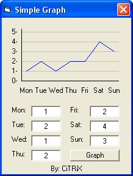



## \[CiTRiX\] Simple Graph

### Description

You enter the numbers and the Code design the graph. It shows how to make a graph with lines. Please vote!
 
### More Info
 

             |
---                |---
**Submitted On**   |2003-12-02 20:50:10
**By**             |[CiTRiX](https://github.com/Planet-Source-Code/PSCIndex/blob/master/ByAuthor/citrix.md)
**Level**          |Beginner
**User Rating**    |4.7 (42 globes from 9 users)
**Compatibility**  |VB 6\.0
**Category**       |[Graphics](https://github.com/Planet-Source-Code/PSCIndex/blob/master/ByCategory/graphics__1-46.md)
**World**          |[Visual Basic](https://github.com/Planet-Source-Code/PSCIndex/blob/master/ByWorld/visual-basic.md)
**Archive File**   |[\[CiTRiX\]\_S1679751232003\.zip](https://github.com/Planet-Source-Code/citrix-citrix-simple-graph__1-50291/archive/master.zip)

